# TAR Intelligence System — Demo Walkthrough

**Version:** February 2026  
**System:** TARS (TAR Intelligence System) for V-22 Osprey Maintenance  
**Purpose:** Transform basic maintenance data reporting into actionable intelligence

---

## Overview

The TAR Intelligence System answers the question maintenance leaders care about most: **"When problem X happens, what typically solves it?"**

The system ingests nearly 15,000 Technical Assistance Requests (TARs) and correlates them with Maintenance Action Forms (MAFs) to surface patterns, recommend solutions, and identify candidates for Technical Publication Deficiency Reports (TPDRs). All AI processing runs on **local models** — no data leaves the network.

**Three core capabilities:**

1. **TAR Lookup** — Instant diagnosis and solution recommendations for new problems
2. **Fleet Analytics** — System-level failure patterns with actionable corrective actions
3. **TPDR Intelligence** — Automated identification of technical publication gaps

---

## 1. TAR Lookup

> **Demo story:** "A maintainer just encountered a new problem. They paste or select the TAR and get instant diagnosis with recommended solutions."

### Landing Page

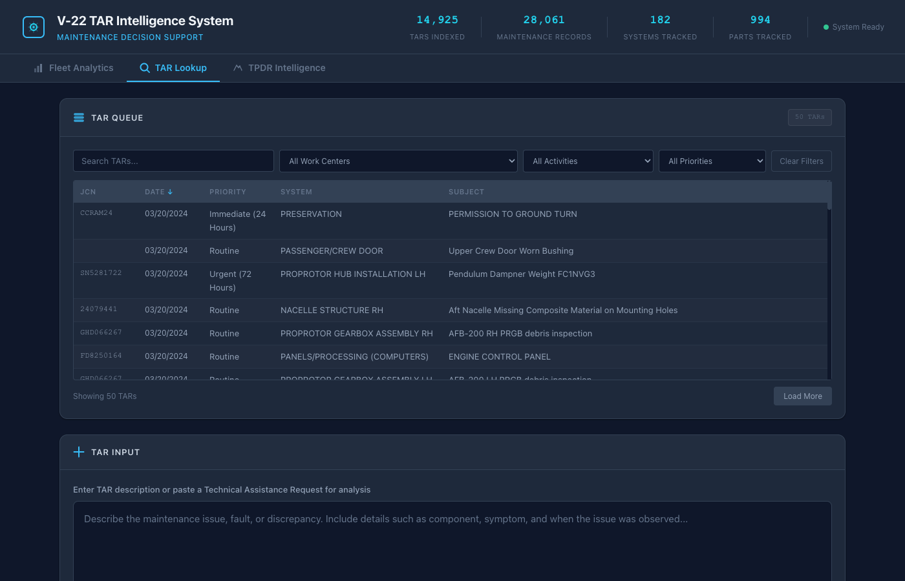

The system opens to the TAR Lookup tab showing three main areas: the TAR input area with sample buttons for quick demo, the TAR Queue showing pending requests, and header statistics summarizing the fleet's maintenance posture.

### TAR Queue — Production Integration

In production, TARs flow into the queue from the submission pipeline. Maintainers see their pending requests and click to analyze. For demo purposes, the sample buttons provide instant access to representative scenarios.

### Diagnosis — Gearbox Chip Detector

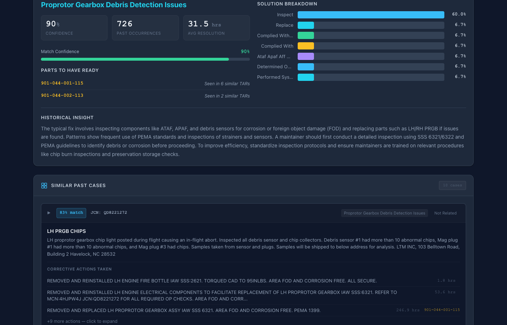

Clicking "Gearbox Chip Detector" triggers the RAG pipeline:

1. The TAR text is embedded using local AI (nomic-embed-text)
2. Cosine similarity finds the most relevant historical TARs
3. Majority-vote cluster mapping identifies the problem category
4. MAF records linked to similar TARs surface what actually fixed it

The **Solution Breakdown** bars show the distribution of corrective actions across similar historical cases — not what someone thinks should work, but what actually worked in practice.

### Similar Past Cases

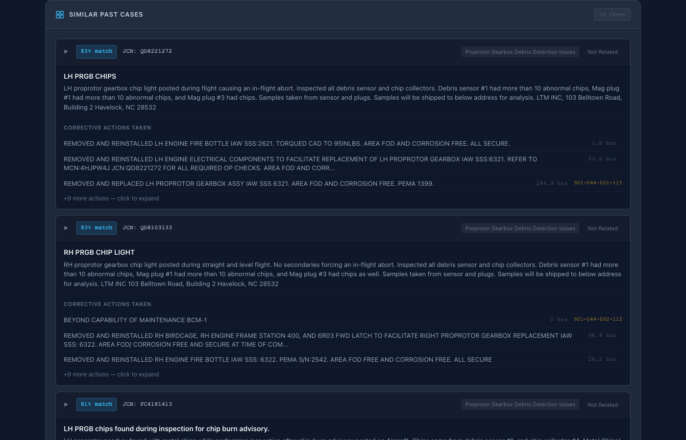

Each similar TAR is displayed with its similarity score, allowing maintainers to see exact precedents. This answers: "Has anyone seen this before, and what did they do?"

### Expanded Case Detail

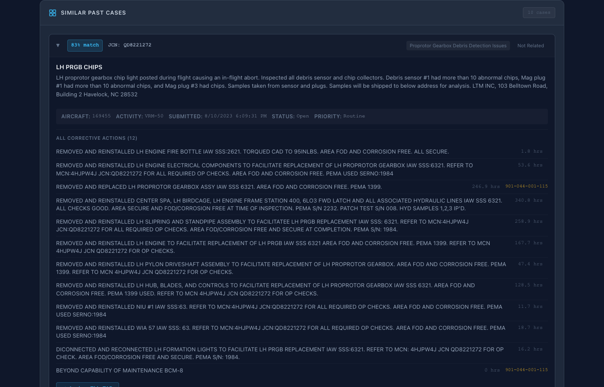

Expanding a case reveals the full TAR text and linked MAF corrective actions. This is the TAR-to-MAF correlation that addresses the "very difficult" problem — connecting what was reported to what was done.

### AI Recommendation

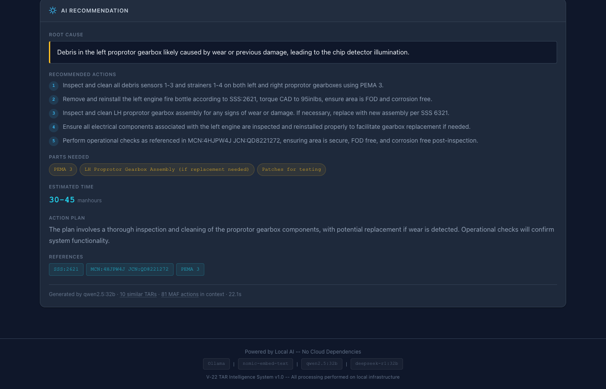

A structured AI recommendation synthesizes findings from similar cases into actionable guidance. This runs on local models (deepseek-r1 / llama3.1:70b) — no data leaves the network.

### Parts Association

Parts referenced in similar TARs are surfaced automatically, helping supply chains prepare the right components. Parts are sourced from actual similar maintenance events, not generic part lists.

### Versatility — FADEC Fault

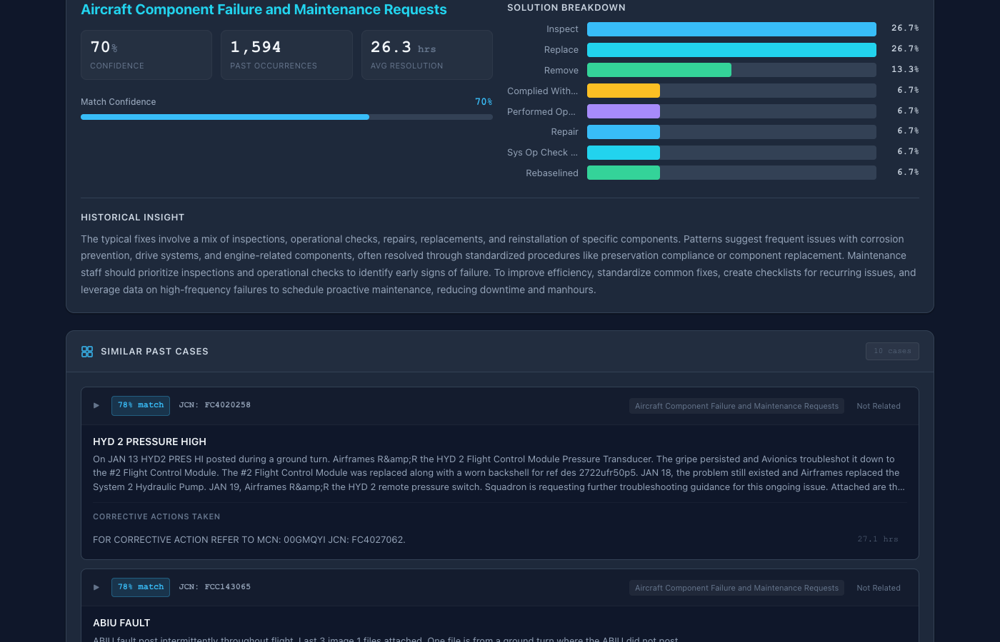

Running a different problem type (FADEC Channel A Fault) demonstrates the system handles diverse failure modes — engine electronics vs. mechanical gearbox issues — with the same pipeline. Different cluster, different solutions, same workflow.

---

## 2. Fleet Analytics

> **Demo story:** "Leadership needs to understand fleet-wide maintenance patterns. Which systems are failing most? What fixes them? How confident are we in the patterns?"

### System View — Fleet Overview

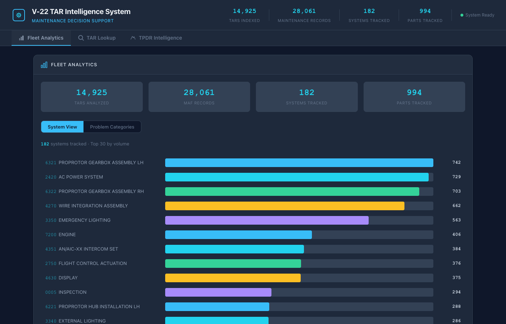

The Fleet Analytics tab defaults to **System View**, organizing all TARs by their UNS (Unified Numbering System) code. This maps directly to how maintenance is organized — by aircraft system, not by abstract problem categories.

The header stat bar shows **182 Systems Tracked** across the fleet, giving immediate context on coverage.

### System Detail — Proprotor Gearbox

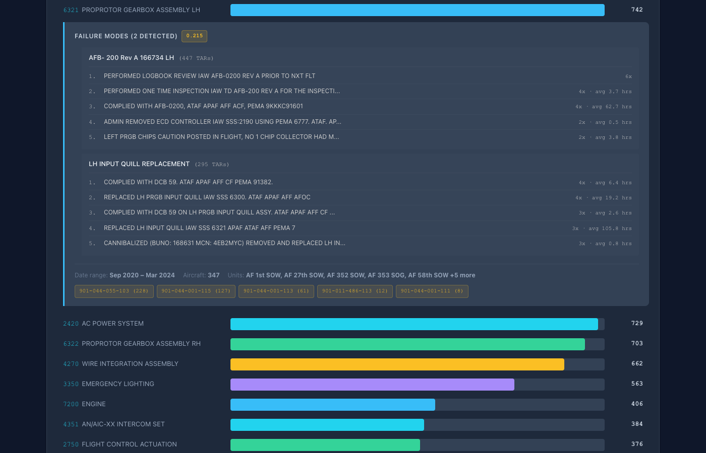

Expanding a system reveals its **failure modes** — distinct patterns of how that system fails, identified through AI clustering of maintenance records. Key elements:

- **Quality Badge (0.215):** Silhouette score measuring how distinct the failure modes are. Higher = more clearly separable patterns.
- **Per-Failure-Mode Corrective Actions:** Each failure mode shows its own top repair procedures with frequency counts and average manhours. BCM disposition codes are filtered out — only actual maintenance actions appear.
- **Quick Stats:** Date range of incidents, number of affected aircraft, and total units involved.

This is the core value: not just "the gearbox has problems" but "the gearbox has two distinct failure patterns, and here's what fixes each one."

### System Detail — Engine

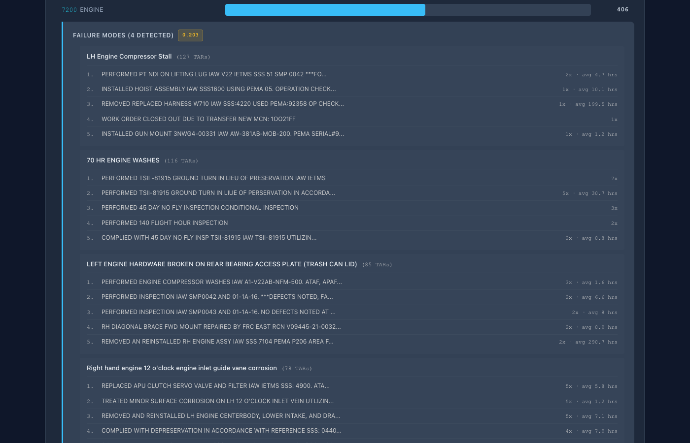

The Engine system shows four failure modes, demonstrating that complex systems surface multiple distinct problem patterns. Each with its own corrective action profile.

### Problem Categories View

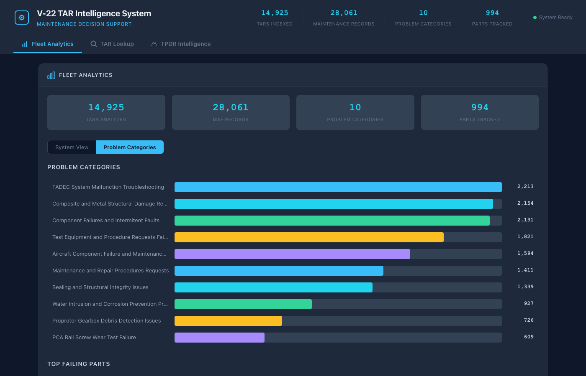

Toggling to **Problem Categories** shows an alternative AI-driven grouping that clusters TARs by problem similarity regardless of UNS system. This catches cross-system patterns that the system-based view might miss.

The stat bar updates to show **10 Problem Categories** reflecting the different view context.

### Category Detail

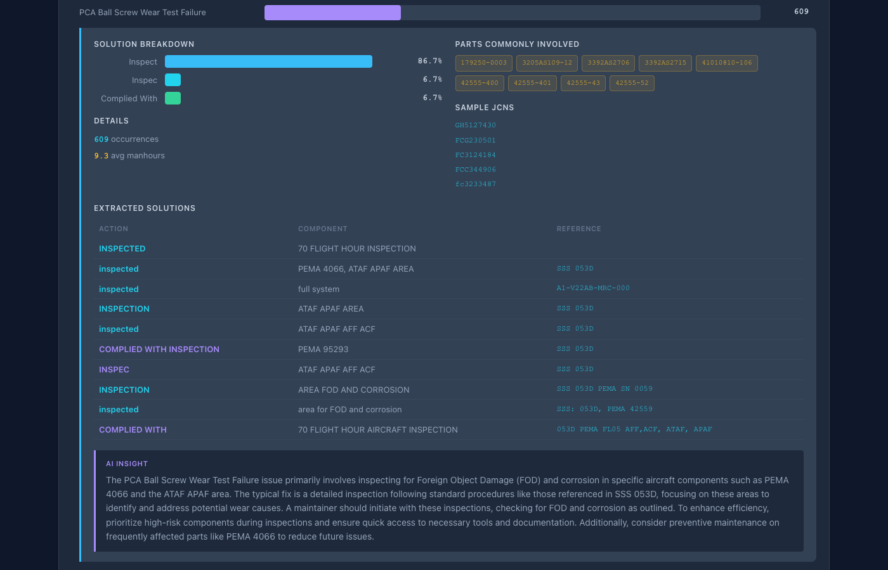

Expanding a problem category shows representative TARs and the corrective actions that resolved similar issues across the fleet.

---

## 3. TPDR Intelligence

> **Demo story:** "When the same problem keeps happening, maybe the technical publications need updating. The system automatically identifies candidates for TPDRs."

### TPDR Candidates

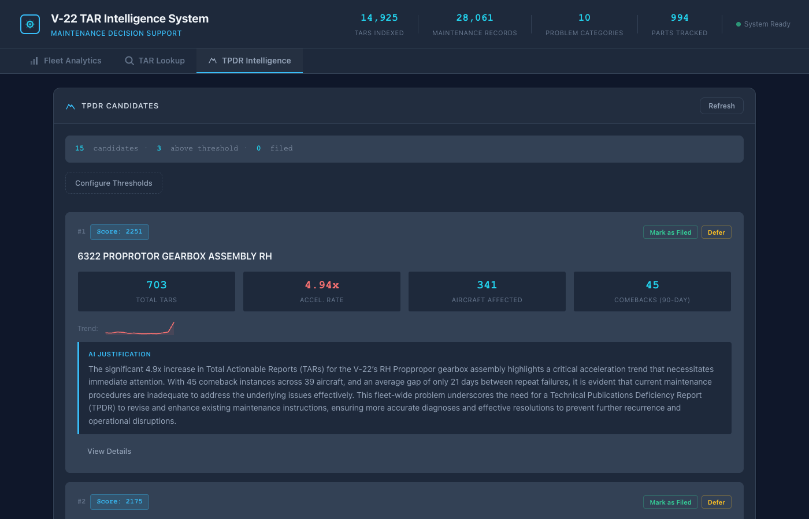

The TPDR Intelligence tab scores potential Technical Publication Deficiency Report candidates based on recurrence patterns, severity, and activity levels. Each candidate shows a composite score and current workflow state.

### Threshold Configuration

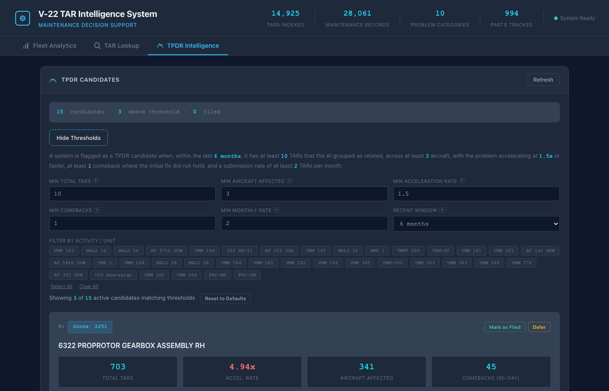

Configurable thresholds let analysts adjust sensitivity for monthly recurrence rates and activity filters. This allows tuning the system for different operational tempos.

### Candidate Detail

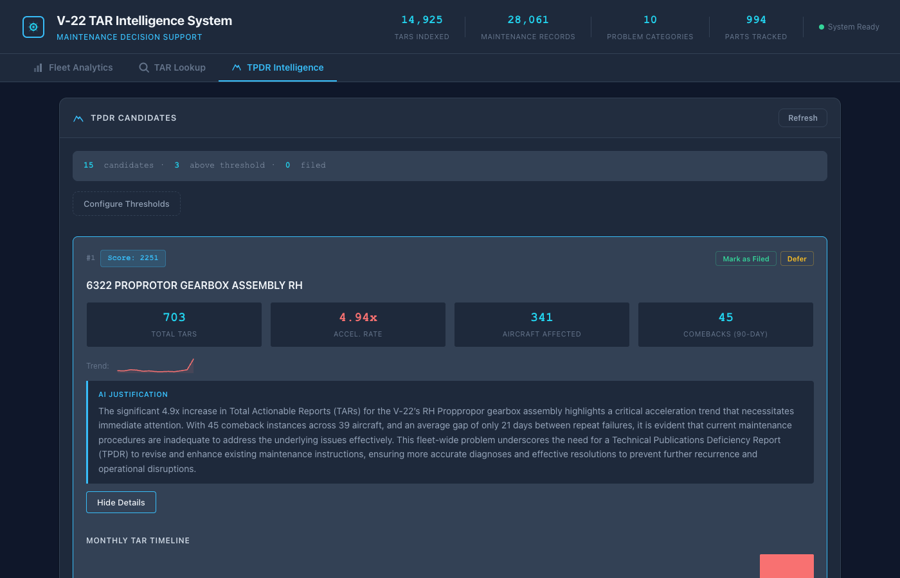

Expanding a candidate shows a plain-English summary of why the system flagged it, supporting documentation of the TPDR justification.

---

## Technical Architecture

| Component | Technology | Purpose |
|-----------|-----------|---------|
| Embeddings | nomic-embed-text (Ollama) | TAR text vectorization |
| Clustering | KMeans + Silhouette optimization | Problem pattern identification |
| Recommendations | deepseek-r1 / llama3.1:70b (Ollama) | Structured diagnosis |
| Correlation | JCN-based TAR↔MAF linking | Problem-to-solution mapping |
| Backend | Python / FastAPI | API and analysis pipeline |
| Frontend | Vanilla JS (single-page) | Zero-dependency UI |

**Key design decisions:**

- **All local AI** — No data leaves the network. Models run via Ollama on local infrastructure.
- **TAR-to-MAF correlation** — The core differentiator. Links what was reported to what was done, solving the "very difficult" correlation problem.
- **Cached analysis** — Sub-clustering and analysis results cached for fast startup after initial computation.
- **BCM filtering** — Administrative disposition codes filtered from corrective actions to surface actual repair procedures.

---

## Data Coverage

- **~15,000 TARs** analyzed and clustered
- **182 UNS systems** tracked with failure mode decomposition
- **10 AI-derived problem categories** spanning cross-system patterns
- **Thousands of TAR-to-MAF correlations** linking problems to solutions

---

## Value Proposition

| Traditional Reporting | TAR Intelligence System |
|----------------------|------------------------|
| "X system had Y failures" | "X system has 2 distinct failure modes — here's what fixes each" |
| Manual TAR review | Instant AI-powered diagnosis with historical precedent |
| Spreadsheet correlation | Automated TAR-to-MAF linking at scale |
| Reactive TPDR identification | Proactive scoring of TPDR candidates |
| Data leaves the network | 100% local AI processing |

---

*Generated: February 2026 | TAR Intelligence System v1.0*
